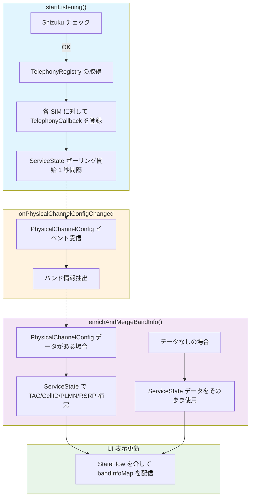
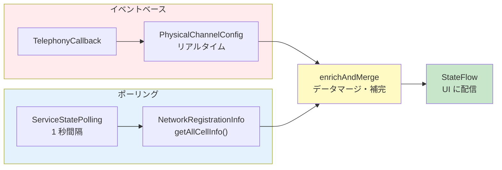
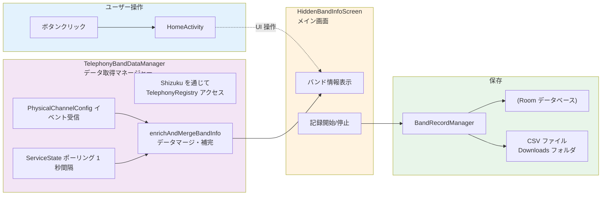
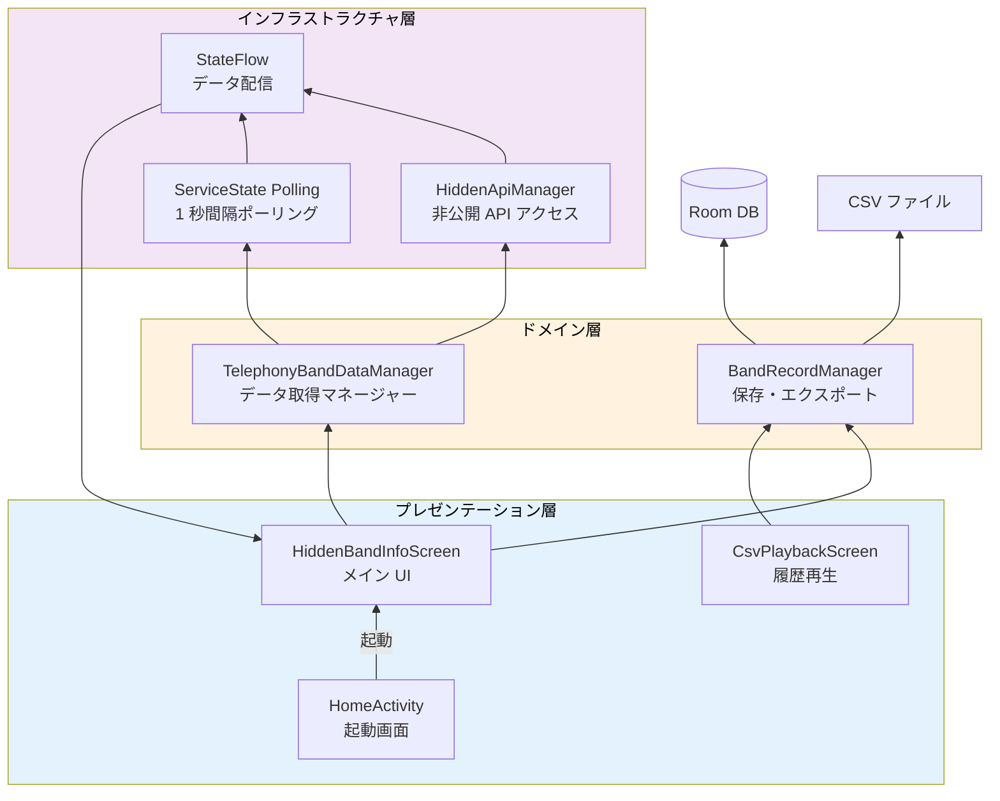

# Hidden Band Info - プロジェクト動作説明資料

## 概要

このプロジェクトは、Android の非公開 API を使用して、通常は表示できない携帯電話の通信バンド情報を取得・表示するアプリケーションです。Shizuku を介してシステムレベルの telephony サービスにアクセスし、5G/LTE のバンド情報、周辺セル情報などをリアルタイムで監視します。

---

## プロジェクト構造

```
app/src/main/
├── java/net/snugplace/hiddenbandinfo/
│   ├── HomeActivity.kt                    # メインアクティビティ (起動画面)
│   ├── PBIApplication.kt                  # アプリケーションクラス
│   │
│   ├── hiddenapi/                         # Hidden API 関連
│   │   ├── TelephonyBandDataManager.kt    # バンド情報取得マネージャー (メイン機能)
│   │   └── HiddenApiManager.kt            # 非公開 API アクセスユーティリティ
│   │
│   ├── data/                              # データ永続化
│   │   ├── BandRecordDatabase.kt          # Room データベース
│   │   ├── BandRecordDao.kt               # データアクセソワヤ
│   │   ├── BandRecordEntity.kt            # エンティティクラス
│   │   └── BandRecordManager.kt           # 記録・エクスポートマネージャー
│   │
│   ├── ui/                                # UI スクリーン (Jetpack Compose)
│   │   ├── HiddenBandInfoScreen.kt        # メイン表示画面
│   │   ├── CsvPlaybackScreen.kt           # CSV 履歴再生画面
│   │   ├── DebugScreen.kt                 # デバッグ情報画面
│   │   └── PipCompactView.kt              # PIP モード用コンパクト UI
│   │
│   ├── services/                          # サービス
│   │   └── KeepAliveService.kt            # アプリをバックグラウンドで維持するサービス
│   │
│   ├── receivers/                         # BroadcastReceiver
│   │   └── StopAppReceiver.kt             # アプリ停止時の処理
│   │
│   ├── location/                          # 位置情報
│   │   └── LocationHelper.kt              # 位置情報取得ユーティリティ
│   │
│   ├── debug/                             # デバッグ機能
│   │   └── BandDebugLogger.kt             # デバッグロギング
│   │
│   └── theme/                             # UI テーマ
│       ├── Color.kt
│       ├── Type.kt
│       └── Theme.kt
```

---

## 各機能の説明

### 1. Hidden API アクセス (HiddenApiManager)

**役割**: Android の非公開 API にアクセスしてバンド情報を取得する

#### 主な機能:

| メソッド | 説明 |
|---------|------|
| `initialize()` | Hidden API Bypass を初期化 |
| `getServiceStateForSubscriber(subId)` | 指定された SIM の ServiceState を取得 |
| `getNetworkRegistrationInfoList(serviceState)` | ネットワーク登録情報を取得 |
| `getCellIdentity(regInfo)` | セルアイデンティティ (TAC/CellID/MCC など) を取得 |
| `extractMcc/cellId/tac/pci` 等 | 各フィールドを抽出 |
| `estimateNrBandFromNrarfcn()` / `estimateLteBandFromEarfcn()` | ARFCN からバンド番号を推定 |

#### 使用される非公開 API:

- `ServiceState.getNetworkRegistrationInfoList()` - 登録中のネットワーク情報リスト
- `NetworkRegistrationInfo.getCellIdentity()` - セル識別情報
- `CellIdentity` の各種フィールド (mcc, mnc, tac, ci, bandwidth, pci など)
- `PhysicalChannelConfig` の隠しフィールド

---

### 2. TelephonyBandDataManager

**役割**: バンド情報の取得・管理・配信を行うメインマネージャー

#### 処理フロー:



#### データフロー:



#### 主要なクラス/メソッド:

| クラス/メソッド | 説明 |
|----------------|------|
| `CustomTelephonyCallback` | TelephonyRegistry のイベントリスナー (PhysicalChannelConfig・DataConnectionState) |
| `startListening()` | コールバック登録とポーリング開始 |
| `stopListening()` | コールバック解除とリソース解放 |
| `getBandInfoFromServiceState()` | ServiceState からバンド情報を抽出 (1 秒間隔で実行) |
| `processPhysicalChannelConfigs()` | Callback で取得した PhysicalChannelConfig を処理 |
| `enrichAndMergeBandInfo()` | 2 つのデータソースをマージして補完 |

---

### 3. BandRecordManager

**役割**: バンド情報をデータベースに保存し、CSV でエクスポートする

#### 主な機能:

| メソッド | 説明 |
|---------|------|
| `recordBandInfo()` | 単一バンド情報の記録 (位置情報付き) |
| `recordAllBandInfo()` | 全サブスクリプションのバンド情報を記録 |
| `recordNeighboringCells()` | 周辺セル情報の記録 |
| `exportToCsv()` | CSV ファイルへのエクスポート |
| `getRecordCount()` | レコード数取得 |
| `cleanupOldRecords()` | 古いレコード削除 |

#### データベーススキーマ:

```sql
CREATE TABLE band_record (
    id INTEGER PRIMARY KEY AUTOINCREMENT,
    timestamp INTEGER NOT NULL,           -- ミリ秒単位のタイムスタンプ
    dateTime TEXT NOT NULL,               -- 文字列形式の日時 "yyyy-MM-dd HH:mm:ss"
    subscriptionId INTEGER,               -- SIM サブスクリプション ID (-1 は周辺セル)
    band INTEGER,                         -- バンド番号 (n1, B3 など)
    bandName TEXT,                        -- バンド名 ("5G NR Band n1", "LTE Band 3")
    networkType TEXT,                     -- ネットワークタイプ ("NETWORK_TYPE_NR"など)
    networkTypeName TEXT,                 -- 人間 readable な名前 ("5G NR", "LTE")
    downlinkBandwidthMhz REAL,            // ダウンリンク帯域幅 (MHz)
    uplinkBandwidthMhz REAL,              // アップリンク帯域幅 (MHz)
    earfcn INTEGER,                       -- LTE EARFCN
    nrarfcn INTEGER,                      -- 5G NR-ARFCN
    physicalCellId INTEGER,               -- PCI (Physical Cell ID)
    connectionStatus INTEGER,             -- 接続状態 (1:IDLE, 2:CONNECTING, 3:CONNECTED)
    connectionStatusName TEXT,            -- 人間 readable な状態名
    isNeighboring INTEGER,                -- 周辺セルか？(0/1)
    mcc TEXT,                             -- Mobile Country Code
    mnc TEXT,                             -- Mobile Network Code
    tac INTEGER,                          -- Tracking Area Code
    cellId LONG,                          -- Cell ID (CI)
    rsrp INTEGER,                         -- RSRP (-140 ~ 0 dBm)
    rsrq INTEGER,                         -- RSRQ (-20 ~ 20 dB)
    sinr INTEGER,                         -- SINR (-20 ~ 30 dB)
    signalDbm INTEGER,                    -- 信号強度 (dBm)
    timingAdvance INTEGER,                -- Timing Advance
    latitude REAL,                        -- GPS 緯度
    longitude REAL,                       -- GPS 経度
    altitude REAL,                        // GPS 高度
    accuracy REAL,                        // GPS 精度 (メートル)
    isRoaming INTEGER                     -- ローミング中か？(0/1)
);
```

---

### 4. HiddenBandInfoScreen (メイン UI)

**役割**: バンド情報の表示・操作を行うメイン画面

#### 主要なコンポーネント:

| コンポーネント | 説明 |
|---------------|------|
| `PhysicalChannelBandInfoCard` | バンド情報カード (SIM ごとに分割表示) |
| `NeighboringCellsCard` | 周辺セル情報カード |
| `PipCompactView` | PIP モード用コンパクト UI |

#### 機能一覧:

| ボタン/操作 | 説明 |
|-------------|------|
| **PI ピクチャーインピクチャーボタン** | PIP モードで画面を小さく表示 |
| **記録トグル** | バンド情報の自動記録開始/停止 (データベース保存) |
| **CSV エクスポート** | 保存したデータを CSV でダウンロード |
| **Refresh メニュー** | リスナーのリスタート |
| **履歴再生 (CSV)** | CSV Playback スクリーンへ遷移 |
| **設定** | PIP モードの設定 (更新間隔、表示項目など) |
| **Debug** | デバッグ情報とログエクスポート |

#### タイムライン機能:

- **ライブモード**: リアルタイムのバンド情報を表示 (スライダー不可)
- **履歴再生モード**: 保存されたスナップショットをスライダーで再生可能
- **最大履歴数**: 600 スナップショット (5 秒間隔なら約 50 分分)

---

### 5. CsvPlaybackScreen

**役割**: 保存した CSV データをタイムライン再生・可視化する画面

#### 主要な機能:

| 機能 | 説明 |
|------|------|
| **CSV 読み込み** | ファイル選択ダイアログから CSV を読み込む |
| **タイムラインスライダー** | 保存されたデータポイントをスライドで再生 |
| **地図表示 (osmdroid)** | 位置情報付きの記録をマーカーとして表示 |
| **色分けモード** | RSRP/SINR/SignalDbm でマーカーの色を変化 |
| **テーブルビュー** | CSV データをテーブル形式で表示 |
| **項目フィルタ** | 表示する列を選択可能 |

---

### 6. PipCompactView

**役割**: PIP (Picture-in-Picture) モード用に最適化されたコンパクト UI

#### 表示内容:

- バンド番号のみ (n1, B3 など)
- EARFCN/NRARFCN
- 帯域幅の簡易表示

```
┌─────────────────────┐
│ n78    39650   100M │
│ n77    620000   100M│
│ n78    40000    50M │
└─────────────────────┘
```

#### 設定項目 (PipSettingsDialog):

| 設定 | デフォルト | 説明 |
|------|-----------|------|
| `pipUpdateIntervalMs` | 1000ms | PIP 画面の更新間隔 |
| `recordIntervalSeconds` | 5s | バンド情報記録の間隔 |
| `showBand`, `showEarfcn`, `showPci` | true | 表示項目の有無 |
| `textSizeScale`, `lineSpacingScale` | 1.0 | テキストサイズ/行間幅のスケール |

---

## データフロー全体図



---

## システムアーキテクチャ

### 主要コンポーネントの関係性:



### 権限と Shizuku の役割:

| 権限 | 用途 |
|------|------|
| `READ_PHONE_STATE` | 電話状態の取得 (SubscriptionManager, TelephonyManager) |
| `ACCESS_FINE_LOCATION` / `ACCESS_COARSE_LOCATION` | GPS 位置情報の取得 |
| `DUMP` | システムダンプへのアクセス (一部 Hidden API) |
| `POST_NOTIFICATIONS` | フォアグラウンドサービス通知 |
| **Shizuku** | システムサービスの直接アクセス権限 (TelephonyRegistry など) |

---

## 設定項目一覧

### PipSettings:

| 設定項目 | デフォルト値 | 説明 |
|---------|-------------|------|
| `showBand` | true | バンド番号の表示 |
| `showEarfcn` | true | EARFCN/NRARFCN の表示 |
| `showPci` | true | PCI の表示 |
| `showBandwidth` | true | 帯域幅の表示 |
| `showActiveSimOnly` | false | アクティブ SIM のみ表示 |
| `textSizeScale` | 1.0 | テキストサイズスケール |
| `lineSpacingScale` | 1.0 | 行間幅スケール |
| `recordIntervalSeconds` | 5 | バンド情報記録の間隔 (秒) |
| `pipUpdateIntervalMs` | 1000 | PIP モード更新間隔 (ms) |

---

## デバッグ機能

### BandDebugLogger:

- メソッド呼び出しのログ出力
- API 結果の詳細表示
- フィールド抽出の追跡
- ログエクスポート機能 (`/sdcard/HiddenBandInfo/debug_YYYYMMDD_HHMMSS.log`)

---

## 依存関係

| ライブラリ | 用途 |
|-----------|------|
| **Shizuku** | システムサービスへのアクセス権限 |
| **Room** | ローカルデータベース |
| **Jetpack Compose** | モダン UI フレームワーク |
| **osmdroid** | 地図表示 (CSV Playback) |
| **Hidden API Bypass** | Android の非公開 API アクセス |

---

## 動作要件

1. **Android 8.0+** (API level 26+)
2. **Shizuku 必須**: システムサービスの直接アクセスが必要
3. **必要な権限の許可**: アプリ起動時に表示されるダイアログで許可

---

*ドキュメント作成日：2026-03-27*
